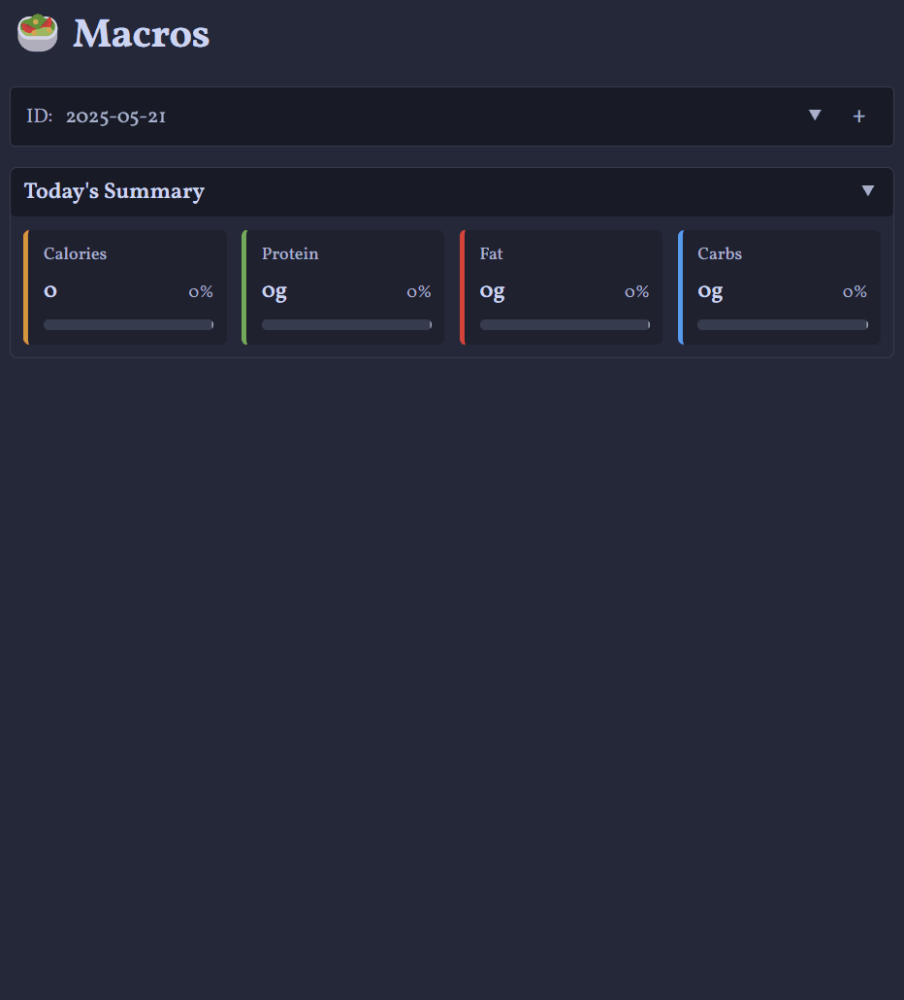

# Macros Plugin for Obsidian

The **Macros Plugin** brings powerful nutrition tracking to your Obsidian vault. It integrates with the FatSecret API to search foods, generate nutrition markdown files, and dynamically render interactive macro tables and visualizations.

---

## 🎬 Demo

### 🔍 Searching for Food



### 🍎 Creating and Visualizing Macros


---

## ✨ Features

### 🥑 **Food Management**
- **Live food search** using FatSecret API with real-time suggestions
- **Manual food entry** for custom items not in the database
- **Markdown food files** with comprehensive nutritional data (calories, protein, fat, carbs)
- **Custom serving sizes** with automatic nutritional scaling
- **Energy unit flexibility** - display in kcal or kJ with automatic conversion

### 🍽️ **Meal & Template System**
- **Meal templates** for quick reusable meal groups
- **Meal composition analysis** with nutritional breakdowns

### 📊 **Macro Tracking & Visualization**
- **Interactive macro tables** (`macros`) with collapsible sections
- **Pie chart visualizations** (`macrospc`) with customizable colors
- **Multi-day aggregation** (`macroscalc`) to combine multiple macro blocks
- **Daily targets tracking** with progress indicators and remaining/exceeded notifications
- **Dashboard views** with summary cards and progress bars

### 🌍 **Localization & Accessibility**
- **Multi-language support** - currently English and Spanish (more coming!)
- **Automatic language detection** based on your Obsidian interface language
- **Cultural adaptation** for date formats, number formatting, and dietary terminology
- **Accessibility features** including tooltips, keyboard navigation

### ⚙️ **Advanced Features**
- **Developer mode** with debug logging and advanced options
- **Real-time updates** across all macro blocks when data changes
- **Responsive design** optimized for both desktop and mobile use

---

## 🌍 Localization

The Macros plugin supports multiple languages and welcomes translation contributions!

- **🇺🇸 English** - Complete ✅
- **🇪🇸 Spanish** - AI-generated, needs native speaker verification ⚠️
- **🇫🇷 French, 🇩🇪 German, 🇮🇹 Italian, 🇯🇵 Japanese, 🇰🇷 Korean** and 30+ more languages - Contributors needed 🔍

**Want to help translate?**
- 📖 Read our [Localization Guide](LOCALIZATION.md)
- 🤝 All Obsidian-supported languages are welcome
- 🏆 Contributors will be credited in the plugin

[**→ Contribute a translation**](LOCALIZATION.md)

---

## 📦 Installation

### Via Obsidian Community Plugins (Recommended)
1. Open Obsidian Settings → Community Plugins
2. Disable Safe Mode (if not already disabled)
3. Click "Browse" and search for "Macros"
4. Install and enable the Macros plugin

### Manual Installation
1. Download the latest release from [GitHub](https://github.com/JamesCliffordSpratt/macros/releases)
2. Extract the files to your vault's plugins folder: `VaultFolder/.obsidian/plugins/macros/`
3. Reload Obsidian and enable the plugin in Settings → Community Plugins

---

## 🚀 Quick Start

### 1. **Configure API Access** (Optional but Recommended)
- Register for free [FatSecret API credentials](https://platform.fatsecret.com/platform-api)
- Add your API key and secret in plugin settings
- This enables live food search functionality

### 2. **Add Your First Food**
- Use the ribbon icon (🍎) or command palette
- Choose "Live Search" (with API) or "Manual Entry"
- The plugin creates a `.md` file with nutritional data

### 3. **Create a Macro Table**
Add this code block to any note:

````markdown
```macros
id: today
```
````

Click the **+** button to add foods and meals to your tracking.

### 4. **Visualize with Charts**
Create beautiful pie charts:

````markdown
```macrospc
id: today
```
````

### 5. **Aggregate Multiple Days**
Combine multiple macro blocks:

````markdown
```macroscalc
ids: 2025-01-15, 2025-01-16
```
````

---

## 🎥 Full Video Tutorial

Watch the complete walkthrough on YouTube:

[](https://youtu.be/0cOk846lRuc)

---

## ⚙️ Advanced Usage

### Energy Units
Switch between kilocalories (kcal) and kilojoules (kJ) in settings. All values are automatically converted throughout the interface.

### Meal Templates
Create reusable meal combinations:
1. Go to Settings → Meal Templates
2. Click "Add meal template"
3. Select foods and customize serving sizes
4. Use the template in any macro table with one click

### Multi-Day Tracking
Use date-based IDs for automatic organization

### Custom Serving Sizes
All foods support custom serving sizes with automatic nutritional scaling. The plugin remembers your preferences and suggests appropriate portions.

---

## 🛠️ Settings & Configuration

### **Storage**
- **Storage Folder** – Where nutritional data files are saved (default: "Nutrition")

### **Daily Targets**
- Set your daily goals for calories, protein, fat, and carbohydrates
- Choose between kcal/kJ for energy display
- Progress bars and indicators show your progress toward goals

### **Display Options**
- **Summary Rows** – Show/hide totals, targets, and remaining values
- **Cell Percentages** – Display percentage of daily targets in table cells
- **Tooltips** – Rich hover information (can be disabled)
- **Energy Unit** – Switch between kcal and kJ with automatic conversion

### **Charts & Colors**
- Customize pie chart colors for protein, fat, and carbohydrates
- Live preview shows changes in real-time

### **Meal Templates**
- Create, edit, and manage reusable meal combinations
- Support for custom serving sizes per item

### **API Configuration**
- **FatSecret API** credentials for live food search
- Test connection feature to verify credentials

### **Developer Options**
- **Debug Mode** – Enable detailed logging for troubleshooting
- **Advanced Commands** – Additional commands for power users

---

## 🗺️ Roadmap

### **Short Term**
- [ ] **Imperial units support** (cups, tablespoons, ounces) for serving sizes
- [ ] **Export functionality** (CSV, PDF reports)

### **Long Term**
- [ ] **Micronutrient tracking** (vitamins, minerals) with RDA comparisons
- [ ] **Weekly/monthly summaries** with trend analysis

---

## 🤝 Contributing

We welcome contributions from the community!

### **🌍 Translations**
Help make the plugin accessible worldwide:
- See our [Localization Guide](LOCALIZATION.md)
- All Obsidian-supported languages welcome
- Native speaker verification always needed

### **🐛 Bug Reports & Feature Requests**
- [Open an issue](https://github.com/JamesCliffordSpratt/macros/issues) on GitHub
- Include your Obsidian version, plugin version, and steps to reproduce
- Feature requests are welcome with use case descriptions

### **💻 Code Contributions**
- Fork the repository and create a feature branch
- Follow the existing code style and include tests
- Submit a pull request with a clear description

---

## 📄 License

[MIT License](LICENSE) - feel free to modify and distribute.

---

## 🆘 Support & Community

### **Getting Help**
- 📖 Check the wiki (coming soon)
- 🐛 [Report bugs](https://github.com/JamesCliffordSpratt/macros/issues) on GitHub
- 💬 Join discussions in the [community forum](https://github.com/JamesCliffordSpratt/macros/discussions)

### **API Requirements**
To use food search functionality, you need free [FatSecret API credentials](https://platform.fatsecret.com/platform-api). The plugin does not include default API keys for privacy and usage limit reasons.

### **Privacy & Data**
- All data is stored locally in your Obsidian vault
- API calls to FatSecret only occur during food searches
- No personal data is transmitted or stored externally
- Your nutritional data never leaves your device

---

## 🙏 Acknowledgments

### **Contributors**
- **Translations**: [Contributors welcome!](LOCALIZATION.md)
- **Code**: [See all contributors](https://github.com/JamesCliffordSpratt/macros/graphs/contributors)

### **Special Thanks**
- **FatSecret Platform** for providing nutritional data API
- **Obsidian Team** for the excellent plugin ecosystem
- **Community** for feedback, testing, and feature suggestions

---

**Crafted with ❤️ for Obsidian users who love food and data.**

*Last updated: 2025-07-09*
