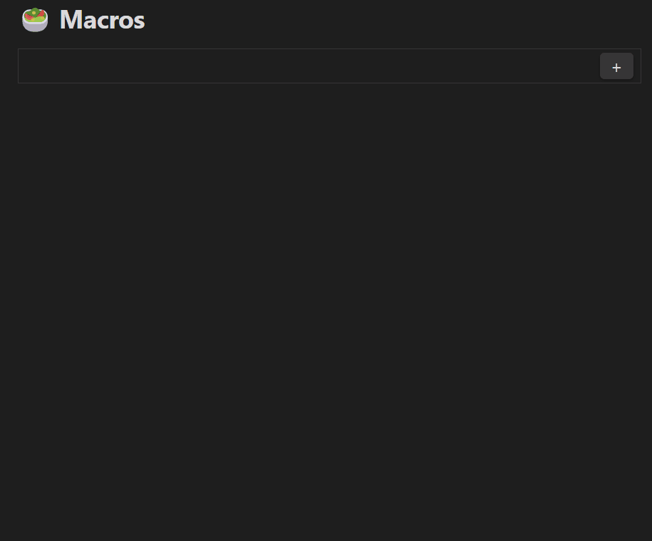
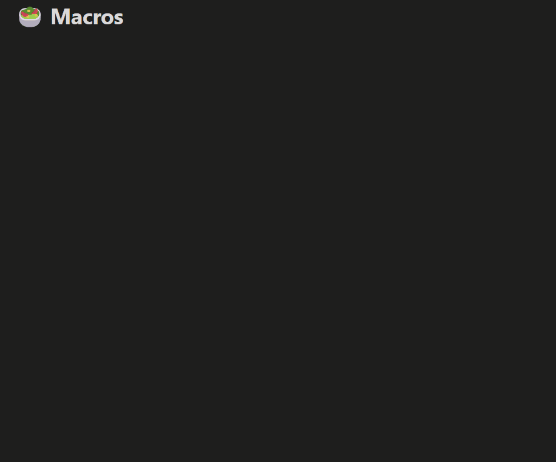

# Macros Plugin for Obsidian

The **Macros Plugin** brings powerful nutrition tracking to your Obsidian vault. It integrates with the FatSecret API to search foods, generate nutrition markdown files, and dynamically render macro blocks and pie charts.

---

## 🎬 Demo

### 🔍 Searching for Food



### 🍎 Creating and Visualizing Macros



---

## Features

- 🥑 **Food Search** using FatSecret API
- 📝 **Markdown food entries** with calories, protein, fat, and carbs
- 📊 **Macros blocks** for organizing food and meals
- 🥗 **Meal templates** for quick reusable meal groups
- 🍽️ **Pie charts** (`macrospc`) to visualize macros
- 📐 **Custom serving sizes** and interactive add/remove

---

## Installation

### Manual (from GitHub)

1. Clone or download this repository.
2. Copy the following files into your Obsidian plugin directory:
   - `main.js`
   - `manifest.json`
3. Enable the plugin in Obsidian settings under **Community Plugins**.

### From Obsidian Marketplace (coming soon)

Once submitted and approved, this plugin will be available in the Community Plugins marketplace.

---

## Usage

### 📦 Searching for Food
Use the command palette or ribbon icon to open **Search for Food**.
Type a food name (e.g., "banana") and select a result.
The plugin saves a `.md` file in your configured folder with nutritional info.

### 📋 Creating Macros Blocks
Add a code block like this to your notes:

````markdown
```macros
id: today
Apple:100g
meal:Lunch
```
````

This renders a table and allows interaction with a `+` button.

### 📊 Pie Charts
To visualize macros as a chart:

````markdown
```macrospc
id: today
```
````

You can also combine multiple blocks:

````markdown
```macrospc
ids: today, yesterday
```
````
Agregated totals table for multiple blocks

````markdown
```macroscalc
ids: today, yesterday
```
````

---

## Settings

- **Storage Folder** – Where food files are saved
- **Colors** – Customize pie chart colors
- **Meal Templates** – Define reusable meal groups
- **FatSecret Credentials** – Add your own API key/secret (optional)

---

## API Credentials (FatSecret)

Default credentials are provided for convenience and are obfuscated in code.
For long-term use, it’s recommended to [register your own](https://platform.fatsecret.com/platform-api) and paste them into plugin settings.

---

## Roadmap

- [ ] More options to fetch imperial units for serving size (cups, tablesoons, teaspoons etc.)
- [ ] Daily calorie goals tracking

---

## License
[MIT](LICENSE)

---

## Feedback / Issues

Please [open an issue](https://github.com/JamesCliffordSpratt/obsidian-macros-plugin/issues) or post in the Obsidian forum thread once it’s live!

---

Crafted with ❤️ for Obsidian users who love food and data.

